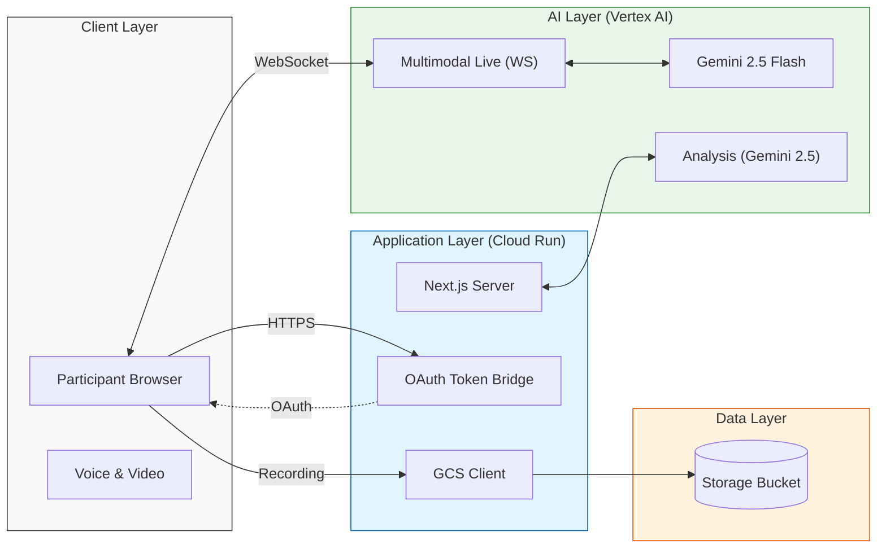

# Fieldwork 🎙️

Fieldwork is an AI-native UX research platform that solves the scaling problem of modern research by using Gemini as a collaborator and a 24/7 researcher.

## The Scaling Problem in UX Research
UX research workflows have a significant scaling problem. Traditionally, conducting high-quality studies requires extensive manual effort to create guides, recruit participants, and moderate sessions. This manual bottleneck limits the frequency and depth of insights teams can gather.

## The Solution: Gemini as your Research Collaborator
Fieldwork transforms the research lifecycle:
- **Guided Creation**: Anyone can create a professional research guide simply by answering questions about their goals, audience, and preferred style. Gemini collaborates with you to refine the depth and focus of the study.
- **Gemini Live Interfacing**: Deploy a bi-directional research agent available 24/7. Participants can engage in natural, voice-first conversations that capture nuanced feedback that static surveys miss.
- **Multilingual Support**: Capture feedback from diverse, global audiences with native multi-language support.
- **Instant Insights**: All feedback is captured as high-fidelity transcripts, with actionable insights generated on demand.

## Architecture



## Setup & Deployment

1. **Install Dependencies**:
   ```bash
   npm install
   ```

2. **Local Development**:
   ```bash
   npm run dev
   ```

3. **Cloud Deployment (GCP)**:
   Ensure you have a GCS bucket created and deploy to Cloud Run:
   ```bash
   gcloud run deploy fieldwork-app \
   --source . \
   --project [PROJECT_ID] \
   --region us-central1 \
   --allow-unauthenticated \
   --set-env-vars "GOOGLE_CLOUD_PROJECT=[PROJECT_ID],GOOGLE_CLOUD_LOCATION=us-central1,GOOGLE_GENAI_USE_VERTEXAI=TRUE,GCS_BUCKET_NAME=[BUCKET_NAME]"
   ```
