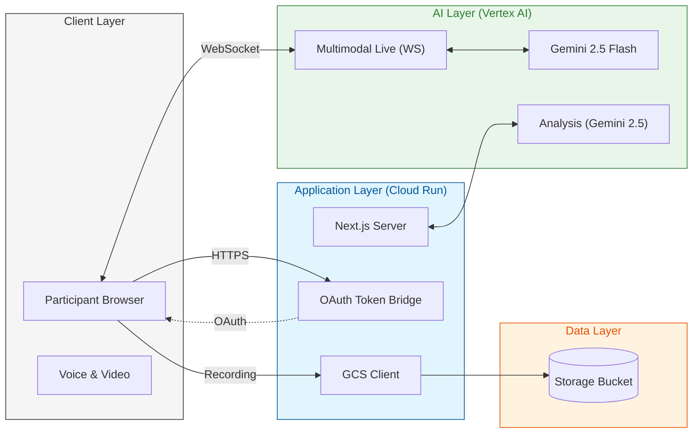

# Fieldwork 🎙️

Fieldwork is an AI-native UX research platform that solves the scaling problem of modern research by using Gemini as a collaborator and a 24/7 researcher.

## The Scaling Problem in UX Research
UX research workflows have a significant scaling problem. Traditionally, conducting high-quality studies requires extensive manual effort to create guides, recruit participants, and moderate sessions. This manual bottleneck limits the frequency and depth of insights teams can gather.

## The Solution: Gemini as your Research Collaborator
Fieldwork transforms the research lifecycle:
- **Guided Creation**: Anyone can create a professional research guide simply by answering questions about their goals, audience, and preferred style. Gemini collaborates with you to refine the depth and focus of the study.
- **Gemini Live Interfacing**: Deploy a bi-directional research agent available 24/7. Participants can engage in natural, voice-first conversations that capture nuanced feedback that static surveys miss.
- **Multilingual Support**: Capture feedback from diverse, global audiences with native multi-language support.
- **Instant Insights**: All feedback is captured as high-fidelity transcripts, with actionable insights generated on demand.

## Architecture



## Hackathon Requirements

### 1. Leverage a Gemini Model
Fieldwork is powered by the **Gemini 2.5** family of models:
- **Real-time Moderation**: Uses `gemini-live-2.5-flash-native-audio` for low-latency, bi-directional voice interactions.
- **Synthesis & Analysis**: Uses `gemini-2.5-flash` for generating tailored research guides and synthesizing session insights.

### 2. Built using Google GenAI SDK
The agent infrastructure is built using the **Google Cloud Vertex AI Node.js SDK** (`@google-cloud/vertexai`). We utilize:
- **Multimodal Live API (WebSockets)**: For real-time, bi-directional agent interactions.
- **Tools / Function Calling**: For interactive multimodal UI elements (e.g., multiple-choice questions).
- **Stream Generation**: For real-time text synthesis and guide generation.

### 3. Use Google Cloud Services
Fieldwork is a cloud-native application deeply integrated with the **Google Cloud Platform (GCP)**:
- **Vertex AI**: Hosting all Gemini 2.5 models and managing the real-time agent infrastructure.
- **Cloud Run**: Containerized deployment of the Next.js application, utilizing service-to-service authentication (ADC).
- **Cloud Storage (GCS)**: Secure persistence of interview recordings and transcribed data via signed URLs.
- **IAM / Service Accounts**: Secure, ambient authentication across all services without hardcoded keys.

## Testing the Experience

### 1. Create a Research Study
- **Launch the App**: Open Fieldwork in your browser.
- **Select Research Type**: Choose a category (e.g., "Usability Testing" or "Discovery Interview") from the home grid.
- **Define Study**: Fill in the study name, research goals, and target audience. 
- **Collaborate with Gemini**: Click **"Create Study"**. Gemini will instantly collaborate with you to generate a tailored interview guide based on your inputs.
- **Review Guide**: Switch to the **"Guide"** tab to see the AI-generated questions and logic.

### 2. Test the Participant Interview
- **Get the Link**: In the **"Setup"** tab, locate the **"Interview Link"**.
- **Join as Participant**: Open the link in a new browser tab or window.
- **Conduct Interview**: 
  - Ensure your microphone is enabled.
  - Speak naturally with the Gemini-powered research agent.
  - Watch as the **real-time transcript** updates and the agent handles following-up and probing questions.
  - **Auto-Termination**: The interview will conclude automatically when the agent says "concludes our interview."
- **View Results**: Return to the researcher view in the original tab. Go to the **"Responses"** tab to see your transcript and session recording instantly available for analysis.

## Setup & Deployment

1. **Install Dependencies**:
   ```bash
   npm install
   ```

2. **Local Development**:
   ```bash
   npm run dev
   ```

3. **Cloud Deployment (GCP)**:
   Ensure you have a GCS bucket created and deploy to Cloud Run:
   ```bash
   gcloud run deploy fieldwork-app \
   --source . \
   --project [PROJECT_ID] \
   --region us-central1 \
   --allow-unauthenticated \
   --set-env-vars "GOOGLE_CLOUD_PROJECT=[PROJECT_ID],GOOGLE_CLOUD_LOCATION=us-central1,GOOGLE_GENAI_USE_VERTEXAI=TRUE,GCS_BUCKET_NAME=[BUCKET_NAME]"
   ```
